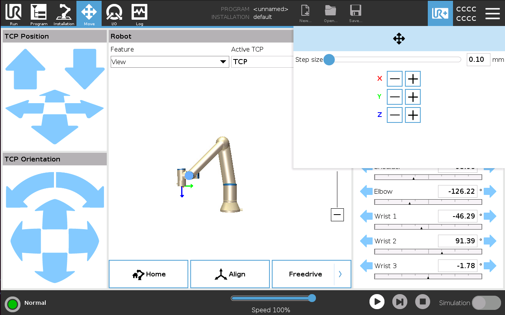

# MyToolbarJog

URCap sample that allows users to incrementally jog the robot in cartesian space through the toolbar. The URCap demonstrates how to:

1. Create a toolbar (as [MyToolbar](https://github.com/UniversalRobots/MyToolbar))
2. Connect to the Dashboard server of the robot through Java
3. Send script commands from a URCap to the robot over the primary client interface
4. Make a Github workflow to build URCap in CI.

## Usage

The URCap functionality is accessed through the toolbar. The step size can be set by either dragging in the (logarithmic) scale or simply entering a value in the input field far right. The robot is then moved by activating one of the six buttons.

## Software Versions
This URCap has been developed using:
- URCap API version 1.12.0
- PolyScope version 5.12.4

Usage of the URCap on any other combination of software remains untested (will likely work however).

## Support

Installation problems? Feature requests? General questions?
* create an issue on the [project](https://github.com/UniversalRobots/MyToolbarJog/issues)

## Contributions

We welcome contributions to this URCap by the community! Please refer to the [Contribution Guide](CONTRIBUTING.md).

## Acknowledgements

This project is developed by the [Universal Robots A/S](https://universal-robots.com/) (UR) and is released under the [BSD 3-Clause License](LICENSE) found in the root of this repository. [Nicolai Anton Lynnerup](https://github.com/naly-ur) developed the URCap to jog the robot incrementally in cartesian space as a response to customer interviews conducted in 2022. The CI in this repo is heavily inspired by the work of [
Felix Exner](https://github.com/fmauch) (from: [FZI](https://www.fzi.de/)) performed for UR when developing the [External Control URCap](https://github.com/UniversalRobots/Universal_Robots_ExternalControl_URCap).
